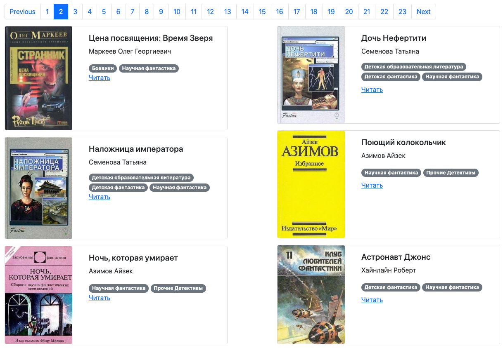

## Online library

This website is the library with books from [Tululu.org](http://tululu.org/l55/).



The library is published here: [GitHub Pages](https://ivankmk.github.io/dvmn_frontend_lesson_5_online_lib/pages/index1.html).

### How to install

1. Clone this repo.
2. 
    ```
    $ pip install -r requirements.txt
    ```
3. ```
    python render_website.py
    ```
3. The library will be avaliable on [127.0.0.1:5500](http://127.0.0.1:5500/pages/index1.html).


### Project Goals

The project made under the umbrella of the Devman Python course [dvmn.org](https://dvmn.org/).