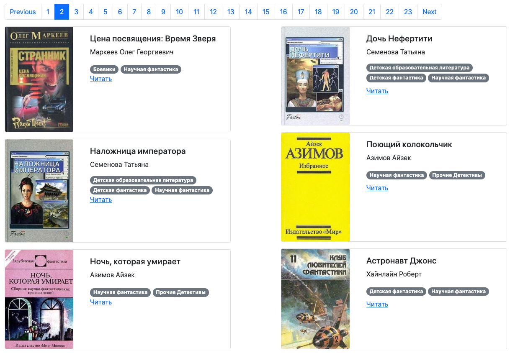

## Online library

This website is the library with books from [Tululu.org](http://tululu.org/l55/).



The library is published here: [GitHub Pages](https://ivankmk.github.io/dvmn_frontend_lesson_5_online_lib/pages/index1.html).

### How to install

1. Clone this repo.
2. Run in your terminal:
    ```
    $ pip install -r requirements.txt
    ```

3. Once all packages installed, run:
    ```
    python render_website.py
    ```
Now you can use dev version of the website which is rendering on [127.0.0.1:5500](http://127.0.0.1:5500/pages/index1.html).

Or alternatively you can open `index1.html` from the `pages` folder.

### Project Goals

The project made under the umbrella of the Devman Python course [dvmn.org](https://dvmn.org/).